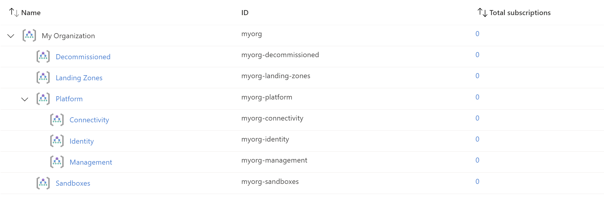

# Create the Management Group Hierarchy

The following will be created:
* Management Groups
* Azure Policy

Navigate to "/Student/03-ALZ-Core" folder
```
cd ./03-ALZ-Core
```

In the "variables.tf" file, update the **root_id and root_name** variables to reflect your assigned team name that you will be using throughout the rest of the deployment.  

Once the files are updated, deploy using Terraform Init, Plan and Apply. 

```bash
terraform init -backend-config="resource_group_name=$TFSTATE_RG" -backend-config="storage_account_name=$STORAGEACCOUNTNAME" -backend-config="container_name=$CONTAINERNAME"
```

> Enter terraform init -reconfigure if you get an error saying there was a change in the backend configuration which may require migrating existing state

```bash
terraform plan
```

```bash
terraform apply
```

If you get an error about changes to the configuration, go with the `-reconfigure` flag option.

# Outcome

## Deployed Management Groups



You have successfully created the default Management Group resource hierarchy, along with the recommended Azure Policy and Access control (IAM) settings for your Azure landing zone.

:arrow_forward: [Deploy management resources](./04-alz-management.md)