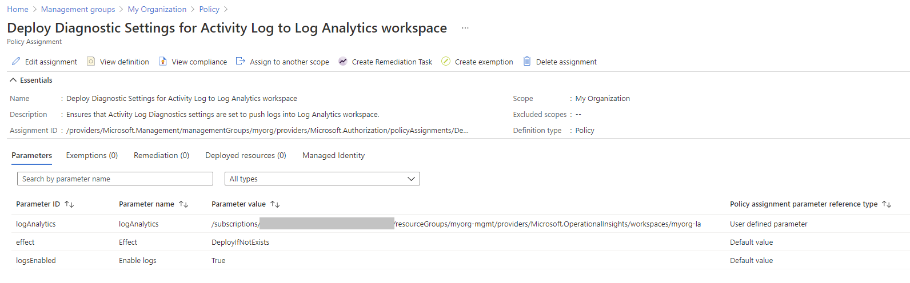
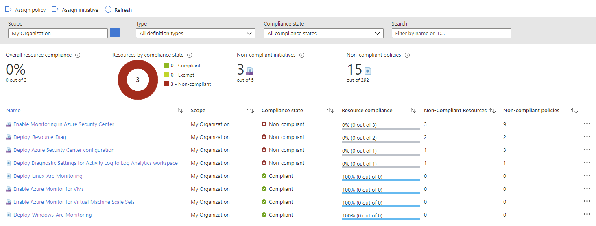
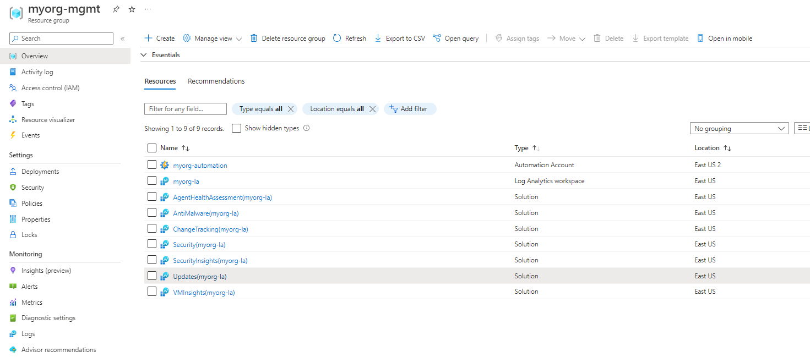

# Deploy the Management Resources

The following will be created:
* Automation Account
* Log Analytics Workspace
    * Agent Health Assessment
    * Antimalware
    * VM Insights
    * Updates
    * Change Tracking
    * Security Inisghts
    * Security


Navigate to "/Student/04-ALZ-Management" folder
```
cd ./04-ALZ-Management
```

In the "variables.tf" file, update the **root_id, root_name, managementSubscriptionId and security_alerts_email_address** variables to reflect your assigned team name that you will be using throughout the rest of the deployment.  

Once the files are updated, deploy using Terraform Init, Plan and Apply. 

```
terraform init -backend-config="resource_group_name=$TFSTATE_RG" -backend-config="storage_account_name=$STORAGEACCOUNTNAME" -backend-config="container_name=$CONTAINERNAME"
```

> Enter terraform init -reconfigure if you get an error saying there was a change in the backend configuration which may require migrating existing state

```
terraform plan
```

```
terraform apply
```

If you get an error about changes to the configuration, go with the `-reconfigure` flag option.

# Outcome

## Policy Assignment configuration

Check the following Policy Assignments to see how these have been configured with settings matching your Management resources configuration set by `configure_management_resources`:

- Scope = `root`
  - `Deploy-MDFC-Config`
  - `Deploy-VM-Monitoring`
  - `Deploy-VMSS-Monitoring`
  - `Deploy-AzActivity-Log`
  - `Deploy-Resource-Diag`
- Scope = `management`
  - `Deploy-Log-Analytics`

These Policy Assignments should all be assigned with custom parameter values based on your configuration, with `enforcement_mode` correctly set.
Once evaluated, the compliance state should also be updated and you can run remediation tasks to remediate any non-compliant resources.

### Policy Assignment parameters example

The following shows the `Deploy-AzActivity-Log` Policy Assignment with a user-defined value set by the module for the `logAnalytics` parameter.
You will see that this value matches the resource ID of the Log Analytics workspace deployed by this module.



### Policy Assignment compliance

When reviewing the Policy Assignment compliance, you will see that some Policies may need remediation.



## Deployed Management resources

You should also have the following resources deployed in your assigned Management Subscription:



:arrow_forward: [Deploy connectivity resources](./05-alz-connectivity.md)