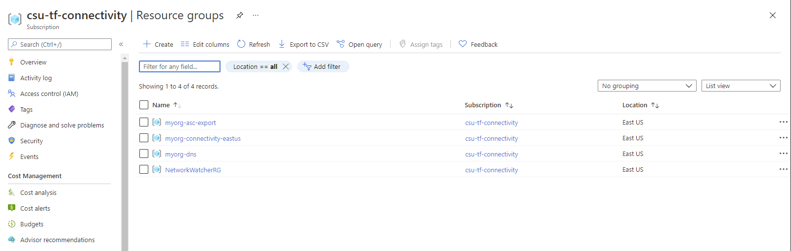
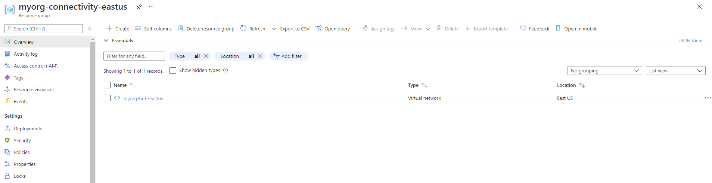
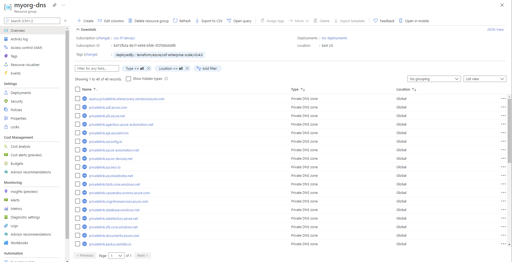

# Deploy Connectivity Resources

The following will be created:
* Azure Firewall
* Virtual Network
* Public IP address
* Private DNS zones
* Azure Policy


Navigate to "/Student/03-ALZ-Core" folder
```
cd ./03-ALZ-Core
```

In the "variables.tf" file, update the **root_id, root_name and connectivitySubscriptionId** variables to reflect your assigned team name that you will be using throughout the rest of the deployment.  

Once the files are updated, deploy using Terraform Init, Plan and Apply. 

```
terraform init -backend-config="resource_group_name=$TFSTATE_RG" -backend-config="storage_account_name=$STORAGEACCOUNTNAME" -backend-config="container_name=$CONTAINERNAME"
```

> Enter terraform init -reconfigure if you get an error saying there was a change in the backend configuration which may require migrating existing state

```
terraform plan
```

```
terraform apply
```

If you get an error about changes to the configuration, go with the `-reconfigure` flag option.

# Outcome

## Deployed Connectivity resources

Once deployment is complete and policy has run, you should have the following resource groups deployed in your assigned connectivity subscription:



> **NOTE:**
> `myorg-asc-export` is related to the [management resources][wiki_management_resources].
> This should contain a hidden `microsoft.security/automations` resource `ExportToWorkspace` once the [management resources][wiki_management_resources] are configured and Azure Policy has completed remediation.
> `NetworkWatcherRG` is also automatically generated by the Azure platform when at least one virtual network is created within the subscription.

### Resource Group `myorg-connectivity-eastus`

The Resource Group `myorg-connectivity-eastus` should be created, and will initially contain a single virtual network with the name `myorg-hub-eastus`.



When you explore the configuration, note that `myorg-hub-eastus` is pre-configured with subnets for `GatewaySubnet` and `AzureFirewallSubnet`.
DDoS Network Protection should also be disabled to reduce costs, although we recommend you **enable this for production environments**.
The location of both the resource group and virtual network is created in the region specified via the `default_location` input variable, which uses the default value of `eastus` in this example.
These settings can all be changed if needed!

### Resource Group `myorg-dns`

As DNS resource are `Global` resources, the resource group is created in the region specified via the `default_location` input variable, which uses the default value of `eastus` in this example.
All private DNS zone resources are `Global`.



By default we create a private DNS zone for all services which currently [support private endpoints][azure_private_endpoint_support].
New private DNS zones may be added in future releases as additional services release private endpoint support.

We also configure `virtual network links` to connect each private DNS zone to the hub virtual network, which in this example is `myorg-hub-eastus`.
This can be optionally enabled for spoke virtual networks being peered to the hub virtual network.

## Additional considerations

If you are using [archetype exclusions][wiki_archetype_exclusions] or [custom archetypes][wiki_custom_archetypes] in your code, make sure to not disable DDoS or DNS policies if you require policy integration using this module.
The relationship between the resources deployed and the policy parameters are dependent on [specific policy assignments](#policy-assignment-configuration) being used.


You have successfully created the default Management Group resource hierarchy, along with the recommended Azure Policy and Access control (IAM) settings for your Azure landing zone.

:arrow_forward: [Deploy identity resources](./06-alz-identity.md)
