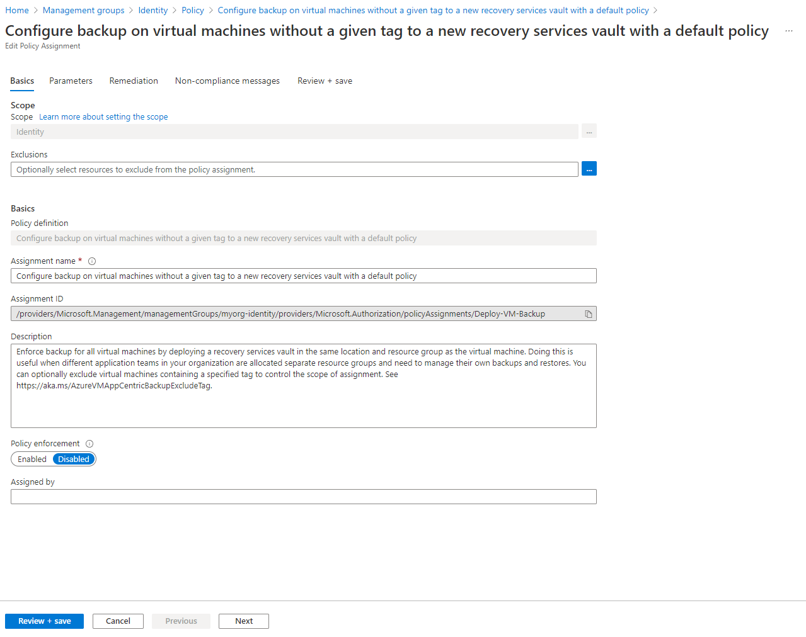

# Deploy Identity Resources

The following will be created:
* Azure Policy

Navigate to "/Student/06-ALZ-Identity" folder
```
cd ../06-ALZ-Identity
```

In the "variables.tf" file, update the **root_id, root_name and identitySubscriptionId** variables to reflect your assigned team name that you will be using throughout the rest of the deployment.  

Once the files are updated, deploy using Terraform Init, Plan and Apply. 

```bash
terraform init -backend-config="resource_group_name=$TFSTATE_RG" -backend-config="storage_account_name=$STORAGEACCOUNTNAME" -backend-config="container_name=$CONTAINERNAME"
```

> Enter terraform init -reconfigure if you get an error saying there was a change in the backend configuration which may require migrating existing state

```bash
terraform plan
```

```bash
terraform apply
```

If you get an error about changes to the configuration, go with the `-reconfigure` flag option.

# Outcome

## Policy Assignment configuration

Check the following Policy Assignments to see how these have been configured with settings matching your Identity resources configuration set by `configure_identity_resources`:

- Scope = `identity`
  - `Deny-Public-IP`
  - `Deny-RDP-From-Internet`
  - `Deny-Subnet-Without-Nsg`
  - `Deploy-VM-Backup`

These Policy Assignments should all be assigned with custom parameter values based on your configuration, with `enforcement_mode` correctly set.
Once evaluated, the compliance state should also be updated and you can run remediation tasks to remediate any non-compliant resources.

In this example, only `Deploy-VM-Backup` will be re-configured. In this case, we are simply setting `enforcement_mode` to `DoNotEnforce`.



## Deployed Identity resources

No resources will be deployed in your `identity` Subscription by this module.